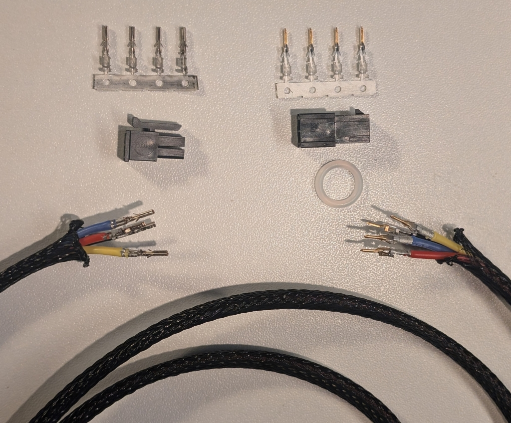
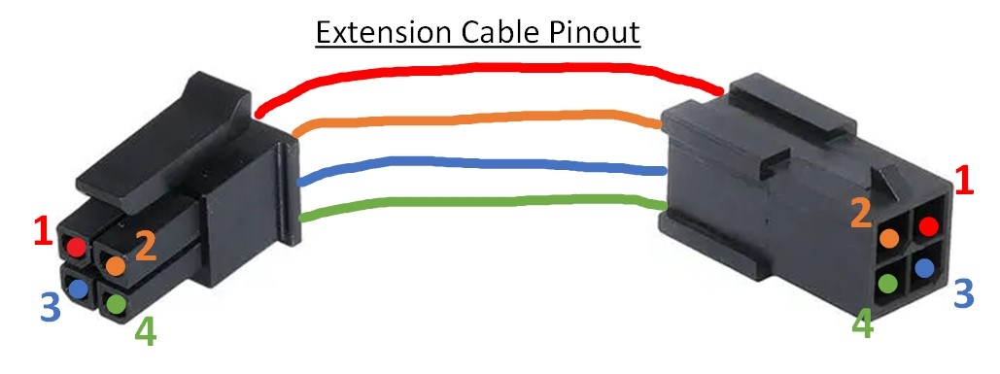
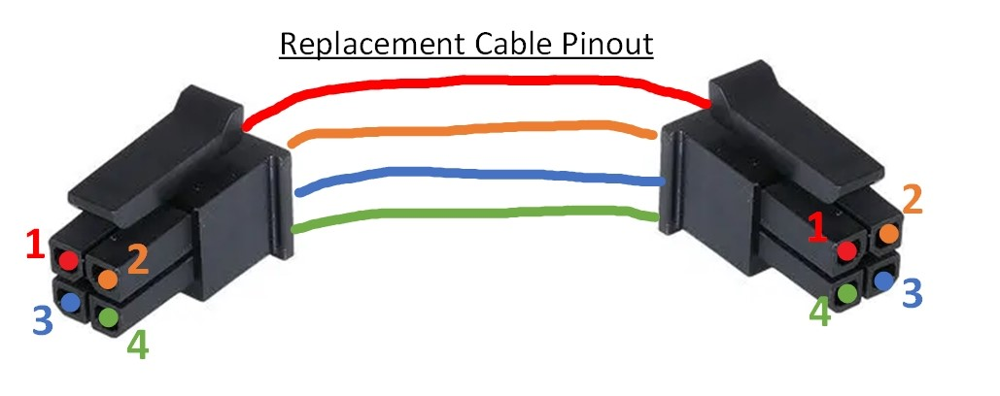
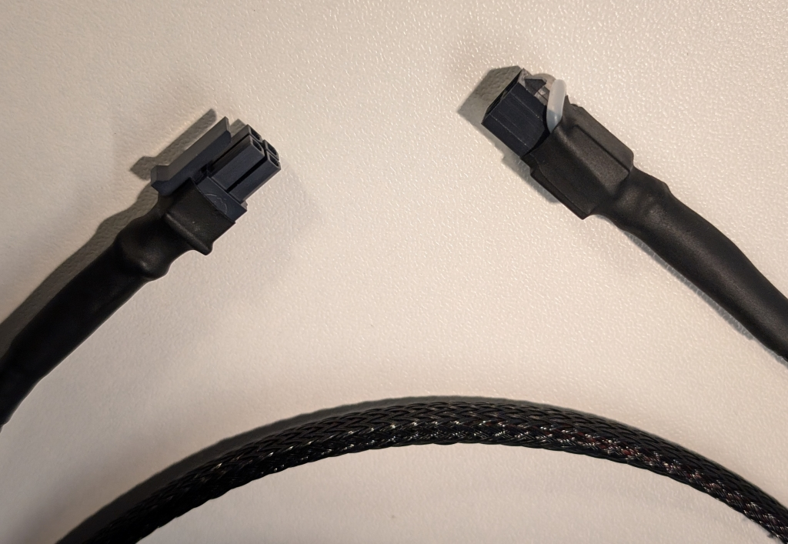
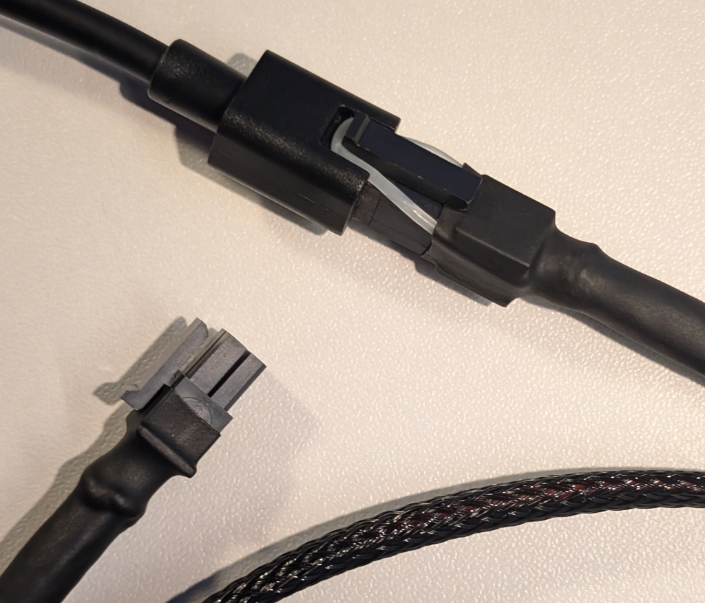
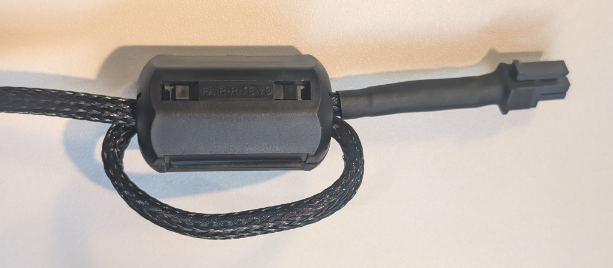

# Bambu A1

# Bambu AMS Lite

### Teardown & Other Internal Images
- https://wiki.bambulab.com/en/ams/maintenance/ams-lite-body
- https://wiki.bambulab.com/en/ams/maintenance/ams-lite-com
- https://wiki.bambulab.com/en/x1/troubleshooting/AMS_is_not_detected_by_the_printer

### Buy It Now Option
So far I've found this [AliExpress](https://www.aliexpress.us/item/1005004748228756.html) item. Which kinda sucks since its for 5 cables with a panel mount style plug, but at least a usable length.

### 4 Pin AMS Lite Cable/Extension Breakdown
Listed here a breakdown of the parts needed to make an extension or replacement cable.

Now the actual [AMS Lite Cable](https://ca.store.bambulab.com/products/ams-lite-4-pin-cable) has what looks like a locking tab but is actually just for show as it does not actually flex. The cable is terminated at both ends so you can choose to make an extension or open the AMS Lite and replace the whole cable.

There is an [Amazon](https://www.amazon.ca/Molex-Micro-Fit-Circuits-Receptacle-Terminal/dp/B078Q798L9/) listing that has all the basic connectors needed to make an extension. But if you are used to ordering from Digikey or Mouser you can get better quality parts for less money.

For reference here are the product specs for the [Molex Micro-Fit 3.0](files/PS-43045-001.pdf) series of connectors.

#### Plug
- Molex Micro-Fit 3.0 Plug Housing, Dual Row, 4 Circuits
  - [Mouser](https://www.mouser.ca/c/connectors/headers-wire-housings/?q=43020&m=Molex&mounting%20style=Cable%20Mount%20%2F%20Free%20Hanging&number%20of%20positions=4%20Position&number%20of%20rows=2%20Row&instock=y) or [Digikey](https://www.digikey.ca/en/products/filter/rectangular-connectors/rectangular-connector-housings/319?s=N4IgjCBcoGwJxVAYygMwIYBsDOBTANCAPZQDaIAzACxwBMdIAuoQA4AuUIAymwE4CWAOwDmIAL6EAHJMQgUkDDgLEyIWgAYKYGAHYmrDpG58hoieDiSE0OWix5CJSOXVNztMDtqz5ihyuc1fRB2TgARIgBXACNMXHFCAFoIG197ZSdyWgo3JKofOyVHVQBWWioYNzExIA)
  - Parts 43020-0401 & 43020-0409 rated to 105c
  - Part 43020-0411 glow wire rated to 125c
- Molex Male Crimp Terminal 20-24awg
  - [Mouser](https://www.mouser.ca/c/connectors/headers-wire-housings/?m=Molex&series=43031&tradename=Micro-Fit%203.0&wire%20gauge=24%20AWG%20to%2020%20AWG&instock=y) or [Digikey](https://www.digikey.ca/en/products/filter/rectangular-connectors/rectangular-connector-contacts/331?s=N4IgjCBcoOwBxVAYygMwIYBsDOBTANCAPZQDa4ALGGAEwIC6hADgC5QgDKLATgJYB2AcxABfQmACccCYhApIGHAWJkQABhD0xIALQRoctFjyESkcjQDMm7Toqz5ikyvMgArG7ANbNB1B4Arspm5G42IiJAA)
  - Part 43031-0001 or 43031-0007 has tin plating
  - Part 43031-0002 or 43031-0008 has 0.38µm gold plating
  - Part 43031-0003 or 43031-0009 has 0.76µm gold plating

#### Receptacle
- Molex Micro-Fit 3.0 Receptacle Housing, Dual Row, 4 Circuits
  - [Mouser](https://www.mouser.ca/c/connectors/headers-wire-housings/?m=Molex&number%20of%20positions=4%20Position&number%20of%20rows=2%20Row&pitch=3%20mm%20%280.118%20in%29&product=Wire%20Housings&tradename=Micro-Fit%203.0&type=Receptacle%20Housings&instock=y) or [Digikey](https://www.digikey.ca/en/products/filter/rectangular-connectors/rectangular-connector-housings/319?s=N4IgjCBcoEwBxVAYygMwIYBsDOBTANCAPZQDaIAzAJwxUBsADCALqEAOALlCAMocBOASwB2AcxABfQnSqIQKSBhwFiZSgBYaNFuy6ReAkeKkg4CaPLRY8hEpHIwGFMHQDsOkJ258hYyYQBWMBg5BSUbVXsNOgCYjy99HyN-cCo4WQsw6xU7ciZmExgwVxDMq2VbNRDWTz0QABEiAFcAI0xcFIBaCDLFbMqomAoWE071UPKI3JAAmFc6EYkJIA)
  - Parts 43025-0400 & 43025-0408 rated to 105c
  - Part 43025-0410 glow wire rated to 125c
- Molex Female Crimp Terminal 20-24awg
  - [Mouser](https://www.mouser.ca/c/connectors/terminals/?m=Molex&product=Terminals&series=43030&tradename=Micro-Fit%203.0&instock=y) or [Digikey](https://www.digikey.ca/en/products/filter/rectangular-connectors/rectangular-connector-contacts/331?s=N4IgjCBcoOwBxVAYygMwIYBsDOBTANCAPZQDa4ALGGAEwIC6hADgC5QgDKLATgJYB2AcxABfQmACccCYhApIGHAWJkQABhD0xIALQRoctFjyESkcjQDMm7Toqz5ikyvMgArG7j2tIkUA)
  - Part 43030-0001 or 43031-0007 has tin plating
  - Part 43030-0002 or 43031-0008 has 0.38µm gold plating
  - Part 43030-0003 or 43031-0009 has 0.76µm gold plating
- Molex Lubricated Female Crimp Terminal 20-24awg
  - [Mouser](https://www.mouser.ca/c/?q=45773-0001) or [Digikey](https://www.digikey.ca/en/products/filter/rectangular-connectors/rectangular-connector-contacts/331?s=N4IgjCBcoOwBxVAYygMwIYBsDOBTANCAPZQDa4ALGGAEwIC6hADgC5QgDKLATgJYB2AcxABfQmACccCYhApIGHAWJkQABhD0xIALQRoctFjyESkcjQDMm7Toqz5ikyvMhLANgCsl61pEigA)
  - Part 45773-0001 has tin plating plus lube
  - Part 45773-0002 has 0.38µm gold plating plus lube
  - Part 45773-0003 has 0.76µm gold plating plus lube

#### Wire
- Any stranded wire that is 20-24awg will work with these terminals
  - Fancy silicone wire option from [Amazon](https://www.amazon.ca/dp/B073RDG2J6?th=1)
- Can also add some braiding also from [Amazon](https://www.amazon.ca/dp/B07FTQ7HM6?th=1)
- Maybe some heat shrink near the connectors, [Amazon](https://www.amazon.ca/900PCS-Heat-Shrink-Tubing-Protector/dp/B09MQ9815Q/)

#### Crimper
- You probably should use a crimper to attached the terminals to the wires
  - EDM cut crimpers are nice, [Amazon](https://www.amazon.ca/gp/product/B086YG8NQB/)
- But if you are making a single cable, a pair of needle nose pliers could work but I dont recommend it
  - Just get extra terminals for the ones you mess up

#### Pinouts

  

#### Extras
- 12mm Silicone o-ring
  - Used as a locking clasp when making an extension cable
- Feritte Choke
  - Used when making a replacement cable
  - You should loop once the cable inside the choke

#### Extra Images

  
  
